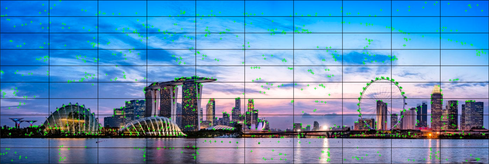
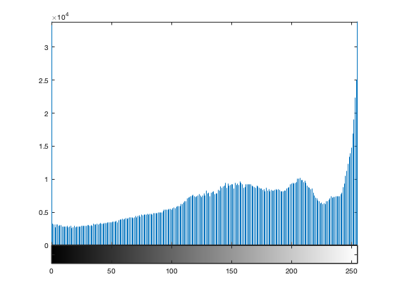
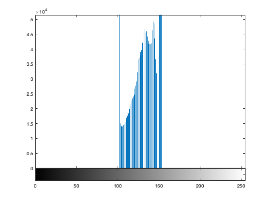

# Panoramic Image Stiching with Low Constrast Images
#### By Rohan Mendiratta, Andrew Degler, Andrew Schaeffer
##### UW-Madison: CS639 Fall 2020

 

### Introduction
Panorama stitching has gained widespread exposure in recent years due to its implementation on the iPhone and other handheld devices. Existing algorithms work well in good conditions but can face difficulties with non-standard datasets that contain changes in contrast (Wei et al., 2019). In particular, popular algorithms that use handcrafted features for keypoint detection such as SIFT and FAST can fail to detect an adequate amount of features in low contrast images and images with low contrast regions (Lentilucci et al., 2018). In order to improve image stitching with low contrast images, we will test two new keypoint detection algorithms and gauge their performance.

### Entropy-Block-Based Harris Corner Detector
Many keypoint detection algorithms use a threshold in order to remove noisy keypoints. This can leave parts of an image lacking any detected features, especially in low contrast areas. In order to combat this, Lentilucci et al. proposed The Entropy-Block-Based Harris Corner Detector (EBB-HCD) in 2018. Instead of using one global threshold for the entire image, the algorithm determines how many Harris corners to keep in a local region of the image by calculating the amount of entropy in that area. Regions or “blocks” of the image that have a high amount of entropy or information relative to all the other blocks in the image are allocated more keypoints.

The benefit of this approach is twofold. First, noise can still be reduced by removing keypoints in areas with a low amount of information. However, unlike SURF and SIFT, no areas are left without any keypoints. As a result, a more even distribution of keypoints is achieved and a more robust transformation matrix can be calculated when stitching a panorama.

Our group implemented the EBB-HCD algorithm in Matlab. The image below has been run through the algorithm.

 

This is the same image but using the SURF algorithm. The keypoints on this image are more concentrated compared to the EBB-HCD.

 

If we lower the contrast, SURF detects far fewer keypoints.

### Key.Net
In 2019, Mikolajczyk et. all proposed Key.Net, a neural network that combines both handcrafted and learned features. The goal of the architecture is to capture the benefits of CNNs that have been demonstrated for keypoint detection while improving on repeatability by including engineered features.

 

Our group ran Key.Net. Below are the keypoints detected.

 

These are the keypoints detected when the image contrast is lowered.

 

### Experiment
We tested SIFT, SURF, Harris, EBB-Harris, and Key.Net to see which keypoint detection algorithm can produce the best panoramas under low contrast. We use backward warping to calculate the homography matrix and RANSAC with 15000 iterations and an error tolerance threshold of 1.

We define contrast as the difference between the highest intensity value and the lowest intensity value. Images with high contrast have intensity values that span the entire range from 0 to 255. The image below is an example of a high intensity image.

 

 

The intensity values for this image are mapped to a smaller range and result in a lower contrast.

 

 

### Results
Each keypoint detection algorithm is able to generate a panorama for images with the full range of intensities.

 

However, there starts to be some odd stitching if the contrast is lowered by mapping the intensity values to a smaller range. Here is a panorama generated with Harris corners at the lower contrast.

 

If we lower the contrast further, both SURF and Harris fail to stitch together the panorama. This is an example of a panorama stitched using keypoints detected by Key.Net at a much lower contrast.

 

The only two keypoint detection methods that were able to successfully stitch the panorama at very low contrast levels were EBB-Harris and SIFT.

 

### Results

SIFT was the best performing algorithm; EBB-Harris also performed well on very low contrast images. One important result is that SIFT performed far better than we initially expected. Additionally, it is important to note that Key.Net could not outperform existing “engineered algorithms” on low contrast images.

Future experimentation could involve the optimization of feature extraction and matching, along with incorporating EBB-Harris elements such as entropy in order to gain a more even distribution of keypoints with Key.Net.

